# Audio To Audio

Audio To Audio is a local-first iOS app for converting audio between source-compatible formats with a simple default flow and advanced controls tucked away when needed.

## Features

- Import from Files (audio/video) and Photos (video with audio).
- Simple default conversion flow with Auto output support.
- Source-compatible output format detection (dynamic per source).
- Advanced settings behind a collapsed section (preset, trim range, fades, network optimization).
- Smart boundary suggestion for cleaner start/end points when trimming is needed.
- Progress + cancel for long-running conversions.
- Share or save converted output.
- i18n-ready string-key architecture with locale resources.

## Showcase

### iPhone 17 (Light + Dark)

  <a href="showcase/high/main-empty-light.png">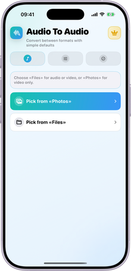</a>
  <a href="showcase/high/trim-adjusted-light.png">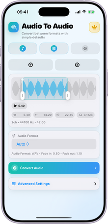</a>
  <a href="showcase/high/trim-formats-open-light.png">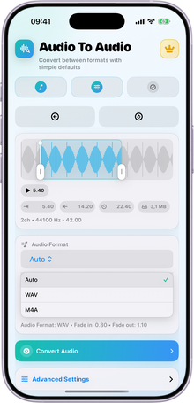</a>

  <a href="showcase/high/trim-advanced-light.png">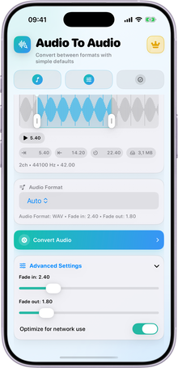</a>
  <a href="showcase/high/done-window-light.png">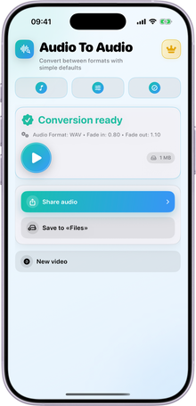</a>
  <a href="showcase/high/paywall-window-light.png">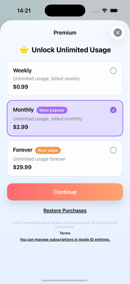</a>

  <a href="showcase/high/main-empty-dark.png">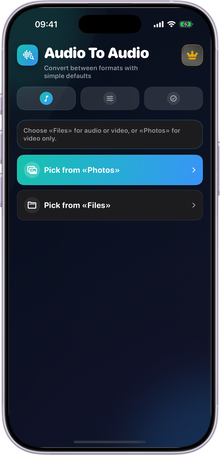</a>
  <a href="showcase/high/trim-adjusted-dark.png">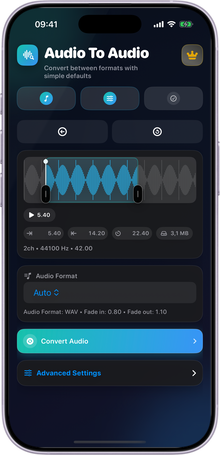</a>
  <a href="showcase/high/trim-formats-open-dark.png">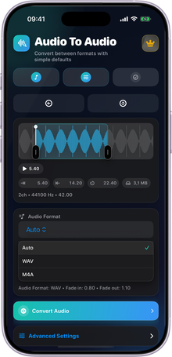</a>

  <a href="showcase/high/trim-advanced-dark.png">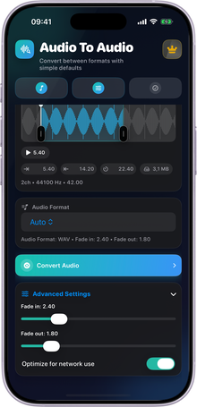</a>
  <a href="showcase/high/done-window-dark.png">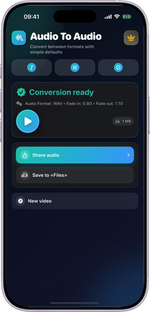</a>
  <a href="showcase/high/paywall-window-dark.png">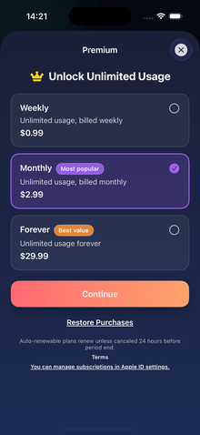</a>

